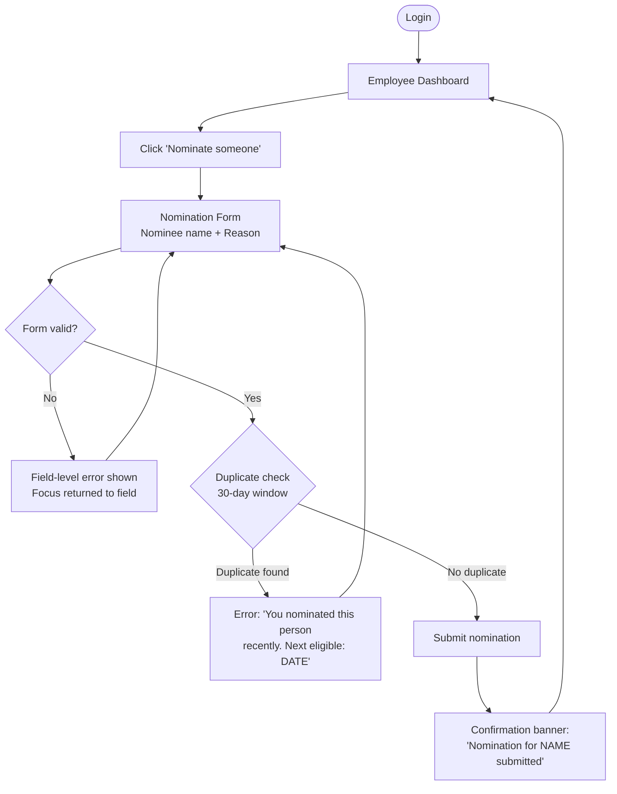
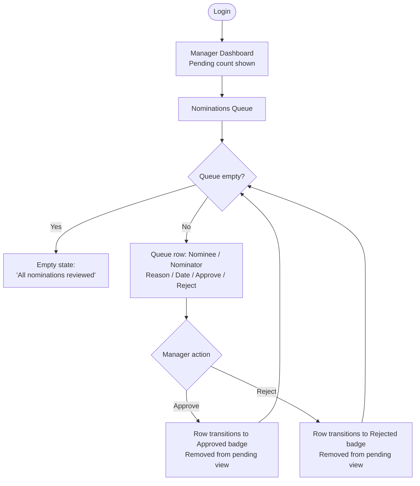
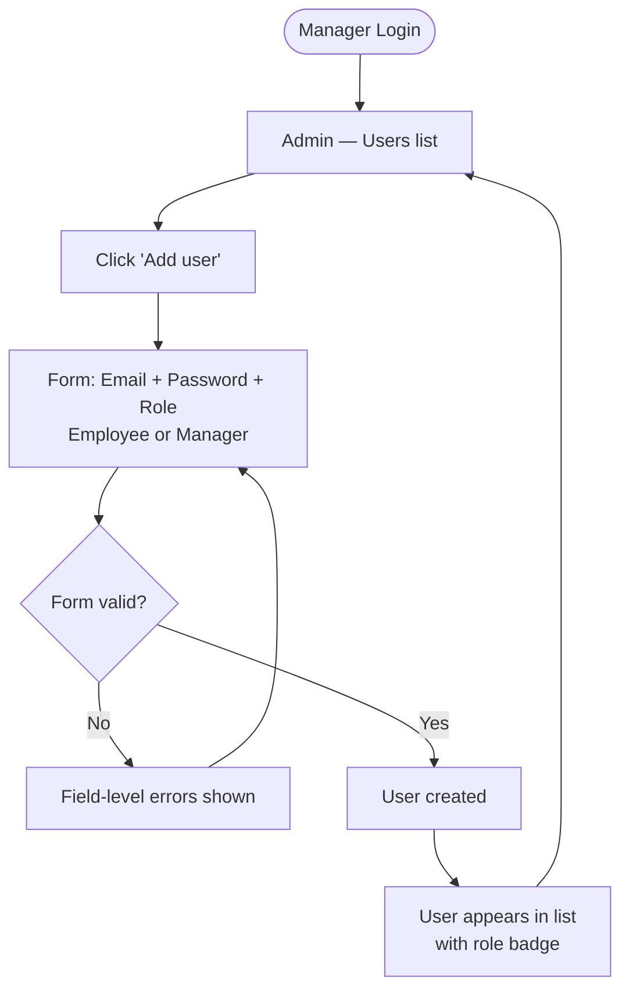
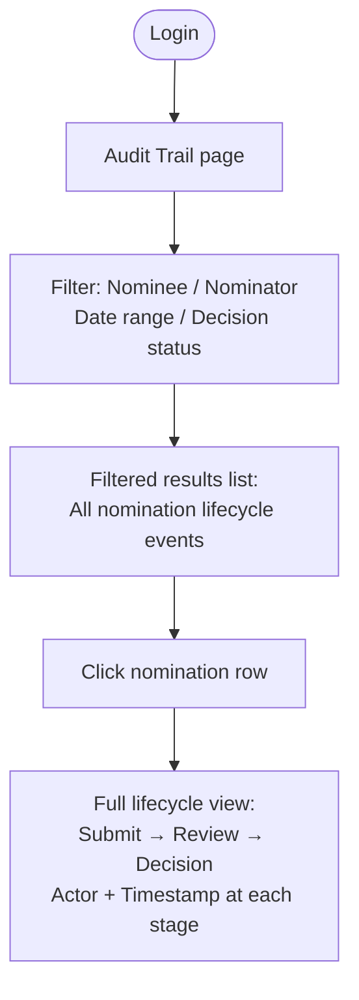

---
stepsCompleted:
  - step-01-init
  - step-02-discovery
  - step-03-core-experience
  - step-04-emotional-response
  - step-05-inspiration
  - step-06-design-system
  - step-07-defining-experience
  - step-08-visual-foundation
  - step-09-design-directions
  - step-10-user-journeys
  - step-11-component-strategy
  - step-12-ux-patterns
  - step-13-responsive-accessibility
  - step-14-complete
inputDocuments:
  - _bmad-output/planning-artifacts/prd.md
---

# UX Design Specification bmad

**Author:** Developer
**Date:** 2026-03-17

---

## Executive Summary

### Project Vision

bmad is an internal employee recognition SPA designed to make meaningful peer contributions visible and actionable. Employees nominate peers through a fast, low-friction workflow; managers review and approve or reject nominations with full context; administrators manage users with minimal overhead. The product turns informal praise into a governed, auditable recognition system with gift card rewards, targeting full company adoption within 12 months of launch.

### Target Users

**Employees** are internal staff recognizing peers. Their primary goal is to submit a nomination in under 2 minutes while at their desk. They are intermediate-level tech users on desktop browsers who need a fast, intuitive form experience with no training required.

**Managers** have dual roles: they approve or reject nominations and administer users. Their approval task must complete in under 5 minutes. They need a clear queue with sufficient context per nomination to make confident decisions without opening detail views whenever possible.

**Support/Operations** users investigate nomination history. They need searchable, filterable audit views that surface the full lifecycle of any nomination within 5 minutes.

### Key Design Challenges

1. **Sub-2-minute nomination flow**: Every click, decision, or field that is unclear adds time. Peer selection, reason entry, and confirmation must be frictionless.
2. **Manager queue at-a-glance decision-making**: Managers must be able to evaluate nominations from the list view, reserving detail views for edge cases.
3. **Role-appropriate navigation**: Employees and managers share the same application but have meaningfully different feature sets. The navigation, dashboard, and entry points must naturally reflect each user's role without confusion or accidental access.

### Design Opportunities

1. **Dashboard as habit loop**: A dashboard that surfaces pending nominations and recognition activity immediately on login can create the kind of routine check-in behavior that drives the 80% adoption target.
2. **Nomination as a rewarding moment**: The flow from peer selection to submission can be designed to feel emotionally satisfying for the nominator — not just functional — reinforcing the act of recognition itself.
3. **Audit trail as visible trust**: An accessible, cleanly formatted audit history doesn't just satisfy compliance needs — it signals to all users that the system is fair, transparent, and taken seriously by the organization.

## Core User Experience

### Defining Experience

The defining experience of bmad is **recognition made immediate**. The product succeeds when an employee thinks "I should recognize someone" and can complete that act within 2 minutes without disrupting their flow. There is no peer lookup, no list to scroll — the employee types a name, writes a reason, and submits. The form is the entire experience.

For managers, the defining experience is **queue closure without friction**. A manager opens the app, sees pending nominations, approves or rejects each one inline without navigating to a detail view, and closes the app having processed everything. The queue is actionable at a glance.

### Platform Strategy

bmad is a desktop-first SPA targeting modern desktop browsers (Chrome, Edge, Firefox, Safari latest). Mobile is out of scope for MVP — the application is not designed or optimized for touch or small screens. No responsive breakpoints or mobile layouts are required. The design should assume mouse and keyboard input and a minimum viewport width appropriate for a standard desktop browser.

### Effortless Interactions

The following interactions must require zero cognitive load:

- **Nomination name entry**: A single free-text field. No autocomplete, no lookup, no user list. The nominator types the peer's name and moves on.
- **Reason entry**: A single free-text field with no required structure, templates, or categories in MVP.
- **Nomination submission**: One button. One confirmation state. Done.
- **Manager inline approve/reject**: Approve and reject actions are available directly on each nomination in the queue list. No detail view required. The manager action takes one click and the queue item resolves immediately.

### Critical Success Moments

**Employee first-time success**: The employee completes their first nomination and sees a clear, unambiguous confirmation that it was received. This moment establishes trust that the act of recognition was actually captured — not lost in a form or pending state that feels uncertain.

**Manager first-time success**: The manager opens their queue, processes every pending nomination inline without needing to navigate away, and arrives at an empty or fully resolved queue. This moment establishes that the manager's oversight role is fast, not burdensome.

Both moments must land cleanly in the first session — they define whether the user returns.

### Experience Principles

1. **Form is the feature**: The nomination form is not a gateway to the experience — it *is* the experience. Optimize it above all else.
2. **Inline over detail**: Wherever a decision or action can be made from a list view, it should be. Detail views are for investigation, not primary workflow.
3. **Desktop, done well**: No mobile compromise. Design for a proper desktop viewport with full keyboard and mouse interaction patterns.
4. **Confirmation closes the loop**: Every submitted action must end with a clear, immediate confirmation. Users should never wonder if something worked.

---

## Desired Emotional Response

### Primary Emotional Goals

**For employees — Accomplished and connected.** When an employee submits a nomination, the primary feeling should be: "I did something good today, and it's been captured." The act of recognition should feel like a small but meaningful contribution to the team's health — not a task completed. Secondary to that, employees should feel **empowered**: they have agency to surface great work, they aren't waiting for a manager to notice.

**For managers — In control and efficient.** When a manager processes their queue, the dominant feeling should be: "I handled that without it becoming overhead." The approval workflow should reinforce that the manager's role is clear and fast, not an administrative burden. Secondarily, managers should feel **fair** — they have sufficient context per nomination to make confident, defensible decisions.

### Emotional Journey Mapping

| Stage | Employee | Manager |
|---|---|---|
| First visit / login | Curious, slightly uncertain — "Is this easy?" | Oriented — "I know why I'm here" |
| Core task | Engaged, purposeful — "I'm doing something that matters" | Focused, efficient — "One click, handled" |
| Task completion | Accomplished, satisfied — "Done. That felt good." | Clear, resolved — "Queue empty, job done" |
| Error / friction | Frustrated only briefly — product must recover them fast | Slightly impatient — clear state prevents confusion |
| Returning visit | Habitual, expected — "Let me check if there's anything to do" | Routine — "Five minutes and I'm done" |

### Micro-Emotions

- **Confidence over confusion**: Every action must be immediately legible. No ambiguity about what a button does, what a status means, or where to go next.
- **Accomplishment over completion**: "Nomination submitted" should feel like a small win, not just a closed form. The confirmation moment matters.
- **Control over obligation**: Managers must feel they are choosing to act, not being pressured. The queue should feel manageable, not overwhelming.
- **Trust over skepticism**: The audit trail and status visibility signal to all users that the system is fair and nothing is lost or hidden.

### Design Implications

- **Accomplished** → Nomination confirmation should be visually distinct and positive — not a small inline message but a clear, satisfying end state
- **Connected** → The dashboard should surface people and activity, not just abstract data; nomination counts tied to real names
- **Efficient** → Manager queue rows must be dense enough to show all decision context without requiring expansion
- **In control** → Approve and reject are always equally visible; neither action should feel buried or discouraged
- **Avoid "admin work"** → No mandatory multi-step flows, no required categories or tags, no forms that ask for more than needed

### Emotional Design Principles

1. **Recognition should feel rewarding for the giver, not just the receiver**: The nomination experience rewards the nominator through a satisfying completion moment.
2. **Every queue should feel closeable**: The manager view should always communicate progress — how many items remain, what's been done — so the task feels finite.
3. **Silence means safety**: When nothing is wrong, the UI should be calm and quiet. Alerts, warnings, and error states should only appear when the user needs to act.

---

## UX Pattern Analysis & Inspiration

### Inspiring Products Analysis

**Linear** — The gold standard for task queue UX. Pending items are dense, keyboard-navigable, and inline-actionable. The manager approval queue should feel like a Linear issue list: all context at a glance, actions one keystroke or click away, and an immutable sense of forward progress as items resolve.

**Google Forms** — The benchmark for low-friction form submission. Simple field progression, one primary action, immediate confirmation. The nomination form should feel this lightweight: no cognitive load, no navigation mid-flow, one clear endpoint.

**Intercom / Zendesk inbox** — The "inbox zero" mental model applied to a work queue. Managers understand this pattern instinctively: pending items accumulate, you work through them, you reach zero, you're done. The approval queue can borrow this emotional model directly.

### Transferable UX Patterns

**From Linear / Zendesk: Inline queue actions**
Rather than opening a detail view to approve or reject, expose primary actions directly on each list row. This eliminates a navigation step and keeps the manager in the queue context throughout.

**From Google Forms: Single-purpose form pages**
The nomination form should be an isolated page or panel — not embedded in a dashboard with competing elements. The user's entire attention should be on the form while they're filling it in.

**From email clients: Unread / pending count as motivation**
Surfacing a pending count on the manager dashboard (e.g., "3 nominations awaiting review") creates a clear call to action without requiring a notification system.

**From Toast notifications: Confirmation that doesn't interrupt**
Post-submission and post-approval confirmations should use non-blocking toast or banner patterns rather than modals, keeping the user in context and allowing them to continue immediately.

### Anti-Patterns to Avoid

- **Multi-step wizard for nomination**: Any flow requiring more than one page/screen to submit a nomination will increase drop-off. Keep it single-screen.
- **Confirmation modals before every action**: Approve and reject are reversible in concept; requiring a "Are you sure?" dialog for every decision slows the manager queue dramatically.
- **Status pages with no actionable next step**: If a user's nomination is pending, the status view should tell them exactly what state it's in — not show a spinner or vague "in progress" label.
- **Mixed role dashboards**: Showing manager-only features to employees (even if disabled) creates confusion. Role-specific dashboards are cleaner than conditional visibility on a shared layout.

### Design Inspiration Strategy

**Adopt**: Linear's inline action pattern for the manager queue; Google Forms' single-field-at-a-time simplicity for the nomination form confirmation state.
**Adapt**: Email inbox "pending count" motivation pattern — adapted to a dashboard summary card rather than a notification badge.
**Avoid**: Multi-step wizards, confirmation modals on primary actions, mixed-role layouts.

---

## Design System Foundation

### Design System Choice

**Themeable component library — shadcn/ui (or equivalent Tailwind-based headless component library)**

For an internal desktop SPA with a small team and MVP timeline, a headless/themeable component library built on Tailwind CSS is the optimal choice. It provides accessible, production-quality components out of the box while remaining fully customizable at the visual layer. There is no visual lock-in to a recognizable "Material" or "Ant Design" look, and the component set covers all MVP needs (forms, tables, buttons, toasts, badges) without custom implementation.

### Rationale for Selection

- **Speed**: Pre-built accessible components eliminate the need to implement form controls, modals, and tables from scratch
- **Accessibility by default**: Keyboard navigation, ARIA roles, and focus management are included in base components
- **Visual flexibility**: Tailwind utility classes allow precise visual customization without fighting a pre-themed design system
- **Desktop-first alignment**: No forced mobile-first breakpoint logic; layouts are designed for the target context
- **Minimal footprint**: Only used components are included in the bundle — no bloat for unused features

### Implementation Approach

Use shadcn/ui component primitives (built on Radix UI) as the foundation. Apply a custom Tailwind color palette and spacing tokens that reflect the brand. All components are copied into the project and owned — not imported from an external package — allowing direct modification without library constraints.

### Customization Strategy

- Override Tailwind CSS variables to establish the brand color palette and typography scale
- Apply consistent border-radius, shadow, and spacing tokens across all components
- Customize the Button, Badge, and Input components to match the visual direction
- Keep all form components (Input, Textarea, Label) visually consistent with the nomination form as the primary use case

---

## Core Interaction Definition

### Defining Experience

The defining experience of bmad is: **"Type a name. Write why. Submit."**

That is the complete employee nomination flow. There is no peer search, no user lookup, no category selection, no multi-step wizard. The entire act of recognition happens in one form with two fields and one button. This is the equivalent of Tinder's swipe — the one interaction that, if made effortless and satisfying, makes everything else follow.

For managers, the defining experience is: **"See why. Decide. Done."**

Each nomination row in the queue shows: who was nominated, by whom, why, and when. Approve or reject inline. No navigation required. The queue empties as fast as the manager can read and decide.

### User Mental Model

**Employees** come to this product with the mental model of sending a message or submitting a form — they understand that kind of immediate action. The risk is that they expect something more complex (choosing a category, selecting from a dropdown) and feel under-served by simplicity. The design should signal that the simplicity is intentional, not incomplete.

**Managers** come with an inbox mental model — a list of things that need their attention that they work through and clear. This is a reliable, familiar pattern. The risk is that nominations feel too sparse to make a confident decision. The design must ensure each queue item exposes enough context that the manager never needs to ask "but why?"

### Success Criteria for Core Interaction

- **Nomination**: Employee can complete a submission in under 5 clicks from dashboard to confirmation, with zero navigation to a second page
- **Approval**: Manager can approve or reject any nomination visible on screen with a single click, without leaving the queue list
- **Confirmation**: Both completion moments show a clear, distinct success state within 500ms of the user's final action
- **Error recovery**: Any validation error identifies the exact field and the exact correction needed — no generic error messages

### Experience Mechanics

**Nomination Flow:**
1. **Initiation**: Employee clicks "Nominate someone" from dashboard — opens nomination form (same page panel or dedicated page)
2. **Interaction**: Focus immediately on "Nominee name" text field → tab to "Reason" textarea → Submit button becomes active when both fields are non-empty
3. **Feedback**: Submit button shows loading state on click; no field disappears
4. **Completion**: Form replaces with a confirmation banner: "Your nomination for [Name] has been submitted." with a secondary link back to dashboard

**Manager Approval Flow:**
1. **Initiation**: Manager lands on dashboard, sees pending nominations count, clicks into queue — or queue is primary dashboard view
2. **Interaction**: Each queue row shows: nominee name, nominator name, reason (truncated with expand), date submitted, and [Approve] + [Reject] buttons inline
3. **Feedback**: On click, row transitions to resolved state (approved/rejected badge) and visually separates from pending items — no page reload
4. **Completion**: When all items are processed, queue shows an empty state: "All nominations reviewed."

---

## Visual Design Foundation

### Color System

An internal recognition product should feel **professional, warm, and trustworthy** — not enterprise-cold or consumer-playful. The palette translates these qualities:

**Primary palette — Indigo/Slate**
Indigo as the primary action color communicates trust and professionalism without the sterility of pure blue. Slate provides a neutral base that feels modern and calm.

```
Primary:       indigo-600   (#4F46E5) — buttons, links, active states
Primary hover: indigo-700   (#4338CA)
Background:    slate-50     (#F8FAFC) — page background
Surface:       white        (#FFFFFF) — cards, panels
Border:        slate-200    (#E2E8F0) — dividers, input borders
Text primary:  slate-900    (#0F172A)
Text muted:    slate-500    (#64748B)
```

**Semantic colors**
```
Success:  green-600  (#16A34A) — approved state, confirmation
Warning:  amber-500  (#F59E0B) — pending state
Error:    red-600    (#DC2626) — rejected state, errors
Info:     sky-500    (#0EA5E9) — informational messages
```

**Accessibility**: All text/background combinations meet 4.5:1 contrast ratio minimum. Primary actions on white backgrounds exceed 7:1.

### Typography System

**Font**: Inter (or system-ui fallback chain). Inter is the standard for modern internal tools — highly legible at small sizes, excellent on desktop screens, no licensing cost.

```
Scale:
  Display:   2rem   / 32px — page titles (rare)
  H1:        1.5rem / 24px — section headings
  H2:        1.25rem / 20px — card headings
  H3:        1rem   / 16px — subsection labels
  Body:      0.875rem / 14px — primary content, queue rows, form labels
  Small:     0.75rem / 12px — timestamps, secondary metadata
  
Line heights: 1.5 for body, 1.25 for headings
Font weights: 400 (body), 500 (labels, buttons), 600 (headings)
```

### Spacing & Layout Foundation

**Base unit**: 4px. All spacing uses multiples of 4px.

```
Spacing scale:
  xs:   4px  — tight internal padding
  sm:   8px  — inline gaps, icon margins
  md:   16px — component padding, form field gaps
  lg:   24px — section spacing
  xl:   32px — page section gaps
  2xl:  48px — major layout divisions
```

**Layout**: Full-width app shell with fixed left sidebar navigation (240px) and a main content area. Dashboard uses a single-column card layout. Queue uses a full-width list. Forms use a centered, max-width-contained layout (max-w-xl, ~672px) to prevent ultra-wide form fields.

### Accessibility Considerations

- All body text at 14px minimum with 4.5:1 contrast
- Form inputs minimum height 40px for easy targeting
- Focus rings: 2px indigo-500 outline with 2px offset on all interactive elements
- Error states communicate via icon + color + text (never color alone)

---

## Design Direction

### Design Directions Explored

The visual direction evaluated: a **clean professional SaaS internal tool** approach — prioritizing information density, clarity, and speed over visual expressiveness. This is the design language of Linear, Notion, and modern HR tooling. The alternative explored was a warmer, consumer-app feel (higher use of color, illustrations, animated interactions) — rejected because it would feel inconsistent with a corporate internal tool context and would slow development.

### Chosen Direction: Clean Professional SaaS

**Layout**: Fixed sidebar navigation with icon + label items. Main content in a white card container on a light slate background. Header bar shows current page title and user context (name, role, logout).

**Visual weight**: Light. White cards, thin borders (1px slate-200), generous internal padding (16–24px), subtle shadows (shadow-sm). The UI should feel open and scannable, not dense.

**Interaction style**: Immediate and direct. Buttons use solid fills for primary actions (indigo), outlined or ghost style for secondary. State transitions are fast (150ms) and functional — no decorative animations.

**Navigation**: Sidebar with 4–5 items max for employees (Dashboard, Nominate, My nominations); slightly extended for managers (+ Pending reviews, Users). Active item uses indigo background indicator.

### Design Rationale

This direction minimizes implementation risk, aligns with user mental models (familiar SaaS pattern), and keeps the visual complexity low so that the content — nomination text, decision context — is the visual priority. Employees and managers should be reading nominations, not navigating a visual interface.

---

## User Journey Flows

### Employee Nomination Flow



### Manager Approval Flow



### Manager User Setup Flow



### Support / Audit Investigation Flow



### Journey Patterns

- **Entry via dashboard**: All journeys start from a role-appropriate dashboard that surfaces the next action without requiring navigation decisions
- **Single-page forms**: All submission flows complete on one screen — no multi-page wizards
- **Inline resolution**: Manager decisions resolve inline in the queue without navigating to a detail page
- **Error recovery keeps context**: All form errors re-focus the user on the same form with the invalid field highlighted — no page resets

---

## Component Strategy

### Foundation Components (from design system)

These components from the shadcn/ui library are used directly with theme customization:

| Component | Usage |
|---|---|
| Button (primary, secondary, ghost) | All CTAs and actions |
| Input | Nominee name field, user creation fields |
| Textarea | Nomination reason field |
| Label | All form field labels |
| Badge | Nomination status (Pending / Approved / Rejected) |
| Card | Dashboard summary cards, form containers |
| Table | User management list |
| Toast | Post-submission and post-action confirmations |
| Separator | Section dividers |
| Avatar | User identity representation in queue rows |

### Custom Components

**NominationFormPanel**
- Purpose: The complete nomination submission experience — two fields and submit
- States: Empty, filling (submit disabled), valid (submit active), submitting (loading), confirmed
- Anatomy: Nominee name input + character hint, Reason textarea + character count, Submit button, confirmation banner
- Accessibility: Form labels programmatically associated, submit announces result to screen readers

**QueueRow**
- Purpose: A single nomination in the manager approval queue with inline actions
- States: Pending (approve/reject visible), Approved (green badge, actions hidden), Rejected (red badge, actions hidden), Processing (actions in loading state)
- Anatomy: Nominee name, Nominator name, Reason text (truncated, expandable), Submission date, Status badge, Action buttons
- Accessibility: Approve/reject buttons have descriptive aria-labels including nominee name ("Approve nomination for Jane Doe")

**StatusBadge**
- Purpose: Visual indicator of nomination lifecycle state
- Variants: Pending (amber), Approved (green), Rejected (red)
- Accessibility: Communicates status via text label, not color alone

**DashboardSummaryCard**
- Purpose: At-a-glance metric on the role dashboard (e.g., "3 pending nominations", "You've submitted 2 nominations")
- States: Zero state (muted), active (normal), actionable (with CTA link)

**EmptyState**
- Purpose: Communicates when a list or queue is empty with a contextual message
- Variants: Queue empty ("All nominations reviewed"), No nominations submitted, No users in system
- Anatomy: Icon, heading, supporting text, optional CTA button

---

## UX Consistency Patterns

### Button Hierarchy

| Tier | Style | Usage |
|---|---|---|
| Primary | Solid indigo, white label | One per form/view — the main action (Submit, Approve) |
| Secondary | Outlined indigo | Supporting actions (Cancel, Back) |
| Destructive | Solid red | Reject action in manager queue |
| Ghost | No border, slate text | Tertiary actions (Expand reason, View history) |

Rules: Never more than one primary button visible in a focused task context. Approve and Reject are treated as peer primary/destructive pair in the queue — both equally visible.

### Form Validation Patterns

- **Trigger**: Validation fires on blur (leaving a field) and on submit attempt — never on keystroke
- **Error display**: Red border on field, error icon, field-level text below input identifying what's wrong and how to fix it ("Reason is required. Please describe the contribution.")
- **Recovery**: Focus returns to the first invalid field on submit attempt
- **Submit state**: Submit button is disabled until all required fields are non-empty (client-side pre-check only; full validation on submit)

### Feedback Patterns

- **Success**: Non-blocking toast appears bottom-right, auto-dismisses after 4 seconds. Green left border. Text: action-specific ("Nomination submitted", "Nomination approved")
- **Error**: Toast with red left border for server errors. Field-level inline errors for form validation.
- **Loading**: Button enters loading state (spinner replaces label) on async actions. Page-level skeleton loaders for initial data fetch. No full-page loading screens.
- **Empty states**: Always include context-specific message and, where appropriate, a CTA to the relevant action

### Navigation Patterns

- Active page indicated by indigo left border indicator on sidebar item
- No breadcrumbs needed for MVP (shallow navigation hierarchy)
- Back navigation uses browser back or an explicit "Back to [parent]" text link — no custom back button UI
- Destructive actions (reject) never trigger navigation; they resolve inline

### Inline Approval Pattern

Approval and rejection happen within the queue row without modal confirmation dialogs. The row transitions to a resolved state immediately on click. A global undo mechanism is out of scope for MVP; the audit trail provides operational recourse if a mistake is made.

---

## Responsive Design & Accessibility

### Responsive Strategy

**Desktop-only MVP.** No mobile breakpoints are designed or implemented. The minimum supported viewport width is 1024px. The layout assumes a standard desktop browser window with a fixed left sidebar.

No graceful degradation is required — the product is an internal tool accessed at a desk. If the viewport is narrower than 1024px, content may clip; this is acceptable for MVP and will not be addressed until post-MVP if mobile adoption is required.

### Accessibility Strategy

**Target: WCAG 2.1 Level AA for core flows** (nomination submission, manager approval, user creation).

Key requirements derived from the PRD (NFR17–NFR21):

| Requirement | Implementation |
|---|---|
| Semantic HTML | Use correct element types (form, button, nav, main, h1–h3). No div-as-button. |
| Form labels | All inputs have associated `<label>` elements (not placeholder-only) |
| Keyboard navigation | All interactive elements reachable via Tab; forms submittable via Enter; modals/panels escapable via Escape |
| Color-independent states | Status (Pending/Approved/Rejected) conveyed by text label and icon, not color alone |
| Contrast ratios | All body text ≥ 4.5:1; large text ≥ 3:1; verified with axe-core in CI |
| Focus indicators | 2px indigo-500 outline with 2px offset on all focused elements; never removed via outline:none without replacement |
| Error announcement | Form errors announced to screen readers via aria-live region on submit |

**Accessibility testing approach**: axe-core automated scan in CI pipeline (zero critical violations gate); manual keyboard-navigation walkthrough of nomination and approval flows before launch.

---

*UX Design Specification complete. Document ready for implementation handoff.*
